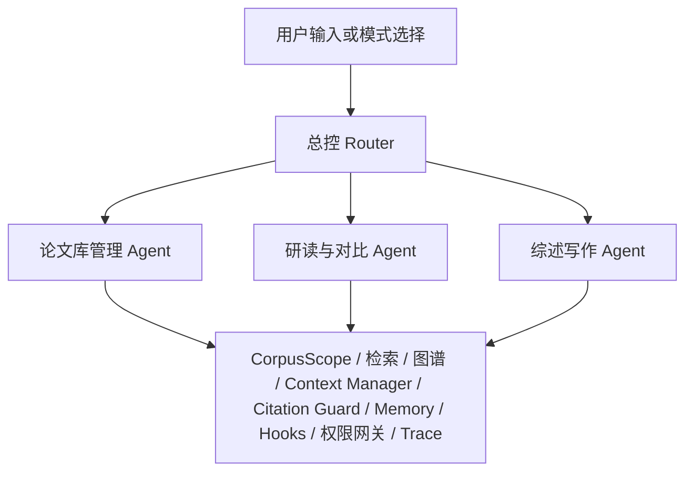
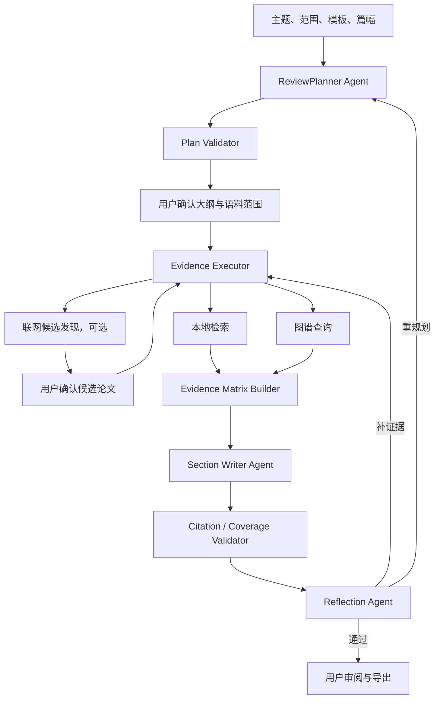

# 读论文 Agent 系统设计与执行方案

## 1. 目标与边界

本项目定位为**证据驱动的论文研究工作台**，支持：

1. 论文上传、解析、索引、版本与工作区管理；
2. 单篇论文讲解，包括方法、公式、图表、实验和局限；
3. 论文库内的技术发现与多论文结构化对比；
4. 基于已选论文的、可追溯的文献综述写作；
5. 经用户确认后的联网候选文献发现。

核心约束：

```text
关键结论 -> Claim -> Evidence Chunk -> 论文 / 章节 / 页码
```

系统不得使用论文库中的其他内容，补全当前上传论文没有明确给出的事实；也不得把“当前论文库未发现”表述为“全领域无人提出”。

## 2. 总体架构



对用户只暴露三个专业 Agent：

| Agent | 用户能力 | 编排方式 |
| --- | --- | --- |
| 论文库管理 Agent | 上传、解析、索引、图谱、入库与版本 | 固定任务工作流 + 异步 Worker |
| 研读与对比 Agent | 单篇讲解、公式图表解释、库内技术发现、多论文对比 | LangGraph 子图 |
| 综述写作 Agent | 规划、证据矩阵、章节写作、反思、审计与导出 | 嵌套 LangGraph 子图 |

总控 Router 是调度器，不是额外的业务 Agent。

## 3. 技术选型

### 3.1 LangGraph、LangChain 与固定工作流

- **LangGraph**：用于需要状态、条件分支、工具调用、反思循环、人工确认、checkpoint 或跨 Agent handoff 的业务子图。
- **固定工作流 / Worker**：用于 PDF 解析、分块、索引等确定性、长耗时任务；不将其伪装为自由 Agent。
- **LangChain**：可作为模型适配、检索器、文档加载和提示模板等底层组件，不使用其自由 Agent Executor 承担核心业务编排。

选择 LangGraph 的原因是论文研究任务需要可审计状态、受控工具调用、可恢复执行、有限循环和人审中断；这些要求高于“让模型自主循环调用工具”的便利性。

### 3.2 保持现有模型策略

| 角色 | 当前模型 / 组件 |
| --- | --- |
| 论文问答与图文理解 | Qwen3-VL-8B-Instruct |
| Claim 语义审计 | GLM-4.1V-9B-Thinking |
| 检索嵌入 | BGE-M3 |
| 重排 | BGE Reranker v2-m3 |
| 论文解析 | MinerU |

Qwen 负责生成与多模态理解，GLM 作为独立 Judge，避免同一模型既生成又自审造成的偏差。

## 4. CorpusScope：论文范围隔离

`CorpusScope` 必须成为请求、检索、生成、审计、Trace 和 Handoff 的显式字段。

| Scope | 含义 |
| --- | --- |
| `temporary_workspace` | 新上传、尚未确认入库的论文 |
| `active_paper_only` | 仅当前阅读论文 |
| `selected_papers` | 仅用户明确选中的论文 |
| `library_only` | 已索引论文库 |
| `web_expansion` | 经确认的联网候选文献发现 |

默认流程：

```text
上传论文 -> temporary_workspace -> active_paper_only
用户要求库内技术发现 -> library_only
用户确认联网扩展 -> web_expansion
```

每个回答和综述章节均显示其证据范围。

## 5. 总控 Router

Router 的优先级为：用户手选模式 > 规则路由 > 低置信度时的结构化模型分类 > 用户澄清。

Router 可产生有依赖关系的多 Agent 调度，但不能直接执行检索、联网、文件或数据库写入。例如：

```json
{
  "dispatches": [
    {
      "agent": "reading_compare",
      "mode": "active_paper_explain",
      "corpus_scope": "active_paper_only",
      "depends_on": []
    },
    {
      "agent": "reading_compare",
      "mode": "library_related_work",
      "corpus_scope": "library_only",
      "depends_on": ["active_paper_explain"]
    }
  ],
  "needs_confirmation": false
}
```

## 6. 论文库管理 Agent 工作流

```text
上传论文
-> 文件、格式、大小和权限校验
-> 创建临时阅读工作区
-> PDF 解析 / OCR / 版面恢复
-> 章节、文本、表格、公式、图片分块
-> 解析质量检查
-> 生成元数据、章节卡和证据卡
-> 稀疏索引、向量索引、概念图谱构建
-> 用户预览
-> 显式确认后提升至论文库或 Workspace
```

每篇论文离线构建四层资产：

```text
Document Map -> Section Card -> Evidence Card -> 原始 Chunk / 图 / 表 / 公式
```

前三层用于导航和筛选；最终 Claim 只能引用原始 Chunk 及其页码锚点。

## 7. 研读与对比 Agent 工作流

```text
Scope Guard / Context Guard
-> 意图与模式识别
-> Evidence Planner Agent
-> Query Rewriter
-> 本地检索 / 图谱查询 / 可选联网候选发现
-> Evidence Merge、去重、重排
-> 单篇讲解 / 技术发现 / 比较矩阵
-> Citation Guard
-> Semantic Judge
-> Reflection：补检索、局部改写、澄清或安全拒答
```

### 7.1 模式

1. `active_paper_explain`：仅当前论文，解释方法、公式、图表、实验和局限。
2. `library_related_work`：将用户想法映射为相同、部分相似、术语相近或未发现四类关系。
3. `multi_paper_compare`：按研究问题、架构、训练目标、数据、指标、成本与局限构建证据矩阵。

比较时每篇论文、每个比较维度只保留 1--2 条高质量证据，禁止将多篇全文送入模型上下文。

## 8. 综述写作 Agent 工作流



内部节点职责：

| 节点 | 类型 | 职责 |
| --- | --- | --- |
| `ReviewPlanner` | Agent | 生成大纲、比较维度、依赖、证据需求和预算 |
| `PlanValidator` | 固定 | 校验 Schema、范围、预算和联网授权 |
| `EvidenceExecutor` | 固定 | 执行受白名单约束的检索和图谱工具 |
| `EvidenceMatrixBuilder` | Agent + 校验 | 构建章节—观点—论文—证据矩阵 |
| `SectionWriter` | Agent | 只基于当前章节证据起草 |
| `CitationGuard` | 固定 | 校验 Claim 与证据映射 |
| `SemanticJudge` | 独立模型 | 审计语义支持关系 |
| `ReflectionAgent` | Agent | 诊断问题并生成受限修复动作 |
| `HumanReview` | 人工节点 | 确认大纲、候选论文、最终稿与导出 |

Reflection 仅允许：`retrieve_more`、`rewrite_section`、`split_scope`、`ask_user_clarification`、`mark_insufficient_evidence`、`safe_refusal`。每章节最多循环 1--2 次。

## 9. Query Rewrite 的位置

问题改写位于“任务范围和证据需求明确之后、检索之前”：

```text
原始问题
-> 输入校验
-> 会话与指代消解
-> Router
-> Evidence Planner
-> Query Rewriter
-> RAG / 图谱 / Web 检索
-> Evidence Pack
-> 生成与审计
```

改写器输出多个受控检索查询，不改写最终要回答的原问题。它的输入包括原问题、已解析实体、`CorpusScope`、任务模式和证据类型要求。明确论文 ID、公式编号、图表编号或术语时可跳过 LLM 改写。

## 10. Context Manager

原则：**全文保留在存储层，模型只接收完成当前节点所需的最小可追溯证据包。**

上下文分为四层：

1. 固定运行上下文：系统规则、权限、Scope、Schema、预算；
2. 任务上下文：当前 Agent、节点、计划、章节和待处理任务；
3. 会话上下文：最近对话、压缩摘要、已确认实体、未解决问题；
4. 证据上下文：当前任务选择的原始 Chunk、表格、公式、图像和页码。

建议的初始总预算为 24K--32K token：

```text
系统规则与安全：2K
任务状态：2K
会话记忆：2K
论文证据：12K--16K
当前草稿：4K
输出预留：2K--4K
```

综述按章节隔离：仅加载全局大纲摘要、当前章节目标、当前章节证据矩阵、当前章节原始证据和必要的过渡摘要。摘要仅用于导航，不能替代原始证据。

## 11. Hooks 与 Handoff

### 11.1 Hooks

| Hook | 职责 |
| --- | --- |
| `before_route` | 身份、输入、Scope 和速率检查 |
| `before_model` | Context Budget、Prompt 边界和输出 Schema |
| `before_tool` | Scope、参数、网络/写入审批和预算校验 |
| `after_tool` | 结果 Schema、脱敏和来源记录 |
| `after_model` | JSON、Claim 和引用要求校验 |
| `on_transition` | Trace、checkpoint、成本和错误记录 |

Hooks 是固定治理代码，不允许模型修改或绕过。

### 11.2 Handoff

Handoff 只用于跨 Agent 边界：论文库管理到研读与对比、研读与对比到综述写作、综述写作到论文库管理。统一使用 `HandoffPacket`，其中只传递 Scope、论文 ID、Artifact 引用、用户目标、已授予权限与确认状态；不传全文或完整聊天历史。

## 12. 权限与沙箱

| Agent | 默认权限 | 需显式确认的权限 |
| --- | --- | --- |
| Router | `session:read`、`route:plan` | 无 |
| 论文库管理 | `file:upload`、`ingestion:run`、`paper:read` | `library:write`、`workspace:write` |
| 研读与对比 | `paper:read`、`graph:read`、`memory:read` | `web:discover` |
| 综述写作 | `paper:read`、`graph:read`、`artifact:write` | `web:discover`、`export:write` |
| Judge | `evidence:read` | 无写入权限 |

必须确认的动作包括扩大检索范围、联网搜索、下载外部论文、写入共享论文库、导出文档和覆盖已有草稿。

PDF 解析在低权限 Worker/容器中执行；输入目录只读，输出仅写入任务临时目录；默认禁网；模型不可调用任意 Shell、路径或数据库语句，亦不可读取密钥。论文和网页正文均视为不可信证据并以明确边界注入 Prompt。

## 13. 可观测性与评测

每次运行记录：Agent、节点、Scope、检索查询数、选中/丢弃证据数、token 预算、工具耗时、重试、反思动作、引用结果和拒答原因。Trace 不保存完整论文正文或密钥。

新增评测集与门禁：

1. 当前论文范围泄漏测试；
2. Router 单/多 Agent 调度正确率；
3. Query Rewrite 的检索增益及意图漂移率；
4. 多论文比较的 Evidence Recall、Citation Validity、矩阵覆盖率；
5. 综述的章节引用覆盖率、证据矩阵覆盖率、人工质量评测；
6. 成本、延迟、上下文预算、失败率和拒答率监控。

## 14. 知识库更新、检索与图数据库策略

### 14.1 双阶段知识库更新

新上传论文不得直接混入正式论文库，采用以下两阶段流程：

```text
上传/解析成功
-> temporary_workspace（用户 + 会话隔离、TTL）
-> 临时 BM25 + 临时向量索引
-> 仅基于新论文的阅读与问答
-> 用户预览并确认
-> 正式库提升事务
-> 正式 BM25 / 向量库 / 图谱 / 元数据一致可见
```

正式库更新以 `paper_id + 内容哈希 + parser_version + embedding_model` 为幂等键。一次提升必须记录可恢复的任务状态；若索引、图谱或元数据任一环节失败，系统应重试或回滚至不可见状态，不能出现“图谱可见但检索不到”或反向的不一致结果。

需要维护论文版本链：重复上传识别、同论文新版本、撤回/失效、重新解析、嵌入模型升级与重建队列。Document Map、Section Card、Evidence Card 作为可重建派生资产，原始 PDF、Chunk 与页码锚点为可追溯源资产。

### 14.2 最近邻、关键词与图谱的职责边界

检索默认采用混合策略：

```text
BM25（术语、符号、公式名、精确短语）
  + 向量最近邻（语义相似 Chunk）
  -> RRF 融合
  -> Cross-Encoder 重排
  -> Scope / Context Budget 过滤
```

向量最近邻用于从长论文中找语义相关原始 Chunk；BM25 用于术语、公式编号、数据集名和精确表达。它们是证据召回的默认路径，不能被图数据库替代。

图数据库只用于结构关系问题：概念别名与消歧、方法—任务—数据集—指标关系、论文/章节/图表导航、引用或演化路径、跨论文共同关系及 Workspace 差异。简单单篇问答、广义语义片段召回和精确文本匹配不应先走图查询。

`EvidenceExecutor` 根据 Evidence Plan 选择 BM25/向量、图查询或两者；图查询输出的是候选 Chunk/论文 ID 和关系路径，最终 Claim 仍必须引用原始 Chunk 与页码。`use_graph=true` 不能只是路由标记，必须对应受授权、可追踪的图查询工具调用。

### 14.3 临时工作区的检索隔离

`temporary_workspace` 维护独立的 BM25 与向量 collection，collection 名称由用户、会话和 workspace ID 派生。查询时必须同时过滤 workspace ID 和临时 paper ID；临时索引不得写入正式 collection，也不得被 `library_only` 读取。TTL 清理同时删除临时元数据、向量 collection、稀疏索引缓存和中间文件。

## 15. 安全边界完善计划

第 12 节的权限矩阵是设计基线；生产部署还必须落实以下边界：

1. **身份与租户隔离**：本地开发可使用本地身份；生产必须由 JWT/OIDC 网关产生 `ActorContext`，不能信任原始请求头。所有 Artifact、Workspace、Trace、任务和导出均按用户/租户校验。
2. **工具与预算治理**：`before_tool`、`before_model` 是强制门禁，不只是观测；校验 allowlist、Scope、模型/工具/网络调用次数、输入输出 token 和速率配额。联网还需要 `web_expansion`、用户确认及 `web:discover` 权限。
3. **文件解析沙箱**：MinerU/OCR 在低权限、默认禁网的容器或 Worker 执行；输入目录只读、输出限制在任务临时目录，限制文件大小、页数、解压大小、CPU、内存和时限。模型不可调用任意 Shell、路径或数据库语句。
4. **不可信内容边界**：PDF、OCR、网页和检索内容都以显式不可信标记进入 Prompt；不得执行其中的指令，不得泄漏系统提示、密钥或跨 Scope 数据。
5. **审计与恢复**：Trace 不保存完整论文正文、密钥或未经脱敏的用户数据；记录授权决策、Scope、工具、预算、索引/图谱提升事务与失败恢复状态。

## 16. 后续执行计划

| 优先级 | 里程碑 | 交付与验收 |
| --- | --- | --- |
| P0 | 临时工作区独立索引 | 临时 BM25/向量 collection、只基于上传论文问答、TTL 级联清理、Scope 泄漏测试 |
| P0 | 图查询接入 EvidenceExecutor | `use_graph` 对应真实受权工具调用；图路径只产生候选，最终引用仍落到 Chunk |
| P1 | 正式库更新事务与版本链 | 幂等提升、任务状态机、失败恢复、重解析/重嵌入队列和版本审计 |
| P1 | 综述深度校验 | 章节 Semantic Judge、Reflection 的补检索/重写/澄清动作、人工审阅与导出 |
| P1 | Web 候选文献发现 | 确认后联网、候选去重与元数据校验、用户选择后再解析入库 |
| P2 | 生产安全与评测 | JWT/OIDC、Worker 容器、限流与配额、端到端评测集和仪表盘 |

### 16.1 P2 的代码交付边界

P2 在代码仓库中交付以下可测试基础设施：章节 Semantic Judge 与有界修复建议；Crossref 元数据候选发现（仅 `web_expansion` 已确认、具备 `web:discover` 权限和网络配额时运行）；可信身份解析契约；解析 Worker 沙箱配置契约；Scope 泄漏与 Router 调度评测基线。

其中 OIDC/JWT 验签、容器编排、真实网络出口策略、限流服务和监控仪表盘属于部署环境职责。运行时只接受外部验证后的身份，不在 Agent 进程中把请求头或未验证 JWT 解释为权限。
